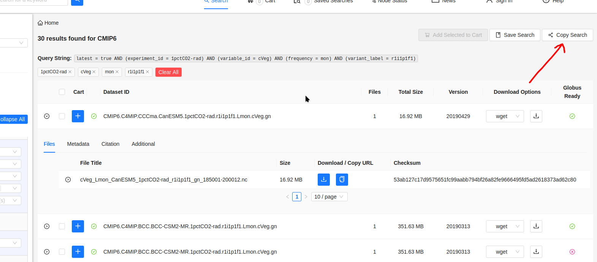

# CMIP Download Script

"Simple" script to automate mass downloads of CMIP data.

To use start by going to the [ESGF website](https://aims2.llnl.gov/search/?project=CMIP6/) and adding all filters as usual until only the datasets of interest are left.

Then click the "Copy Search" button to get the search url.

To run the script and download the files

`python3 -o [output folder] main.py -u '[paste the url here]'`

So for example...

`python3 -o ./MyFavoriteCmipDataFolder -u 'https://aims2.llnl.gov/search/?project=CMIP6&activeFacets=%7B%22experiment_id%22%3A%221pctCO2-rad%22%2C%22variable_id%22%3A%22gpp%22%7D'`

Make sure to include the '' around the url. This will download every file shown on the website so make sure you filter down to only what you want first!

